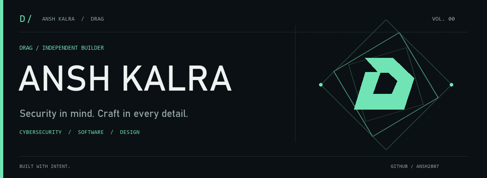

<picture>
  <source media="(prefers-reduced-motion: reduce)" srcset="assets/brand/cover.png">
  
</picture>

# Ansh Kalra · DRAG

**Cybersecurity-minded builder. Software with a point of view.**

I build tools for people who want more control over their software and data: self-hosted authentication, document workflows, local media tools, and evidence-backed intelligence. I care about the interface as much as what runs behind it.

[Explore my work](#selected-work) · [How I build](#how-i-build) · [Instagram](https://www.instagram.com/im_drag_/)

## Selected work

<table>
<tr>
<td width="50%">

### 01 / [Keyforge](https://github.com/ansh2807/keyforge)
**Your software. Your keys.**

Licensing, authentication, device control, and signed client responses on your infrastructure.

`TypeScript` `Next.js` `PostgreSQL`

[Explore the repository →](https://github.com/ansh2807/keyforge)

</td>
<td width="50%">

### 02 / [PDF Studio](https://github.com/ansh2807/pdf-studio)
**A better home for your documents.**

Browser-based PDF editing with a self-hosted engine for OCR, conversion, and redaction.

`React` `Python` `Docker`

[Explore the repository →](https://github.com/ansh2807/pdf-studio)

</td>
</tr>
<tr>
<td width="50%">

### 03 / [Scribe Studio](https://github.com/ansh2807/scribe-studio)
**Every voice. Every frame.**

Local transcription with Indian-language routing, media editing, and target-size compression.

`React` `Python` `FFmpeg`

[Explore the repository →](https://github.com/ansh2807/scribe-studio)

</td>
<td width="50%">

### 04 / [Omniscope](https://github.com/ansh2807/omniscope)
**Follow the evidence.**

Creator and website intelligence with inspectable sources, scores, and reports.

`Python` `FastAPI` `Playwright`

[Explore the repository →](https://github.com/ansh2807/omniscope)

</td>
</tr>
<tr>
<td width="50%">

### 05 / [Creative UI](https://github.com/ansh2807/creative-ui)
**Interfaces with a point of view.**

A frontend design skill with motion effects, project starters, and visual checks.

`JavaScript` `Design systems` `Motion`

[See it in motion →](https://ansh2807.github.io/creative-ui/)

</td>
<td width="50%">

### 06 / [CMS System](https://github.com/ansh2807/CMS-SYSTEM-)
**Next on the workbench.**

An upcoming CMS project. The public repository is a preview; application source is not released yet.

`Coming soon`

[Visit the project preview →](https://github.com/ansh2807/CMS-SYSTEM-)

</td>
</tr>
</table>

## How I build

**Security in the design.** Authentication, permissions, and data boundaries deserve attention from the beginning.

**Control over the stack.** I gravitate toward software people can run on their own infrastructure, with clear choices about external services.

**Craft at the surface.** Typography, motion, and interaction should make a tool easier to understand and better to use.

---

ANSH KALRA / DRAG · Built with intent. 
[Still artwork](assets/brand/cover.png) · [Motion graphics source](tools/generate_brand.py)
